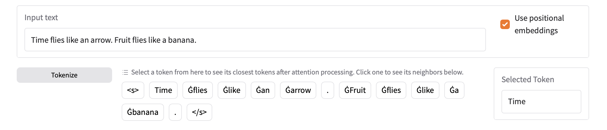

Current demo available [here](https://demo.danavery.com/attention-encodings).

# Dense Paths and Sparse Trails: Token Encoding Journeys in a Transformer Model

## Introduction

This experiment provides an exploratory look into the transformation of individual sequence tokens across the attention layers of a pre-trained RoBERTa model. The focus is on understanding the immediate post-attention output for specific sequence positions and identifying the "nearest" vocabulary tokens in the value encoding space.

Descriptions of transformer architecture often assume that later token encodings have a direct and specific relationship to each originating token, gradually transforming into more abstract or generalized concepts. This holds true for the most part in this analysis—but there are some intriguing exceptions.

## Key Findings

1. *Token Movement Through Layers:* Token encodings shift both toward and away from their original embeddings as they progress through the transformer layers. This movement is measured both by the cosine similarity to the original embedding and by the number of tokens closer to the current encoding than its original embedding.
2. *Context vs. Function Words:* By the final layer, context-dependent words—those that rely on surrounding words to define their meaning—deviate significantly from their original embeddings, conceptually drifting far from their initial representations. In contrast, function words, like "and" or "the," remain much closer to their original embeddings, indicating that the attention mechanism doesn't significantly alter their rankings.
3. *Encoding Space Density:* Interestingly, the cosine similarity between the original embeddings and the final layer embeddings shows only slight variation between content and function words. So while the cosine similarities move in relatively similar ways, the rankings change much more dramatically. This suggests that content words may occupy a denser region in the encoding space than function words.
4. *Radical Shift in Layer 5:* In this RoBERTa model, layer 5 exhibits a dramatic shift, pushing function word token encodings far from their original embeddings. However, by layer 6, they revert closer to their initial positions. Whether this is a particular quirk of the RoBERTa model or a general property of transformers is unclear. It's also unclear if the shift implies a particular recontextualization action or is simply a place where the model goes "off-track" temporarily. The layer 5 shift happens regardless of the token sequence processed.

This behavior suggests that while the attention layers impact the rankings of content words more than function words, this may be attributed more to differences in encoding space density for the two types of tokens than to inherent differences in movement of tokens through the encoding space.

## Usage Instructions

1. Input some text to be tokenized. Hit return or click "Tokenize"
2. Click on one of the displayed tokens
3. Toggle "Use positional embeddings" to see how the distance rankings change when the token's positional embedding is added to the vocabulary embeddings
4. In the "Similarity and Rankings" tab:
    * See the rankings of, and similarity to, the token's encoding against the original token embeddings.
5. In the "Similarity across Layers" tab:
    * See how the cosine similarity changes between the token's encoding and the original token embeddings as the token moves through the layers
6. In the "Rankings across Layers" tab:
    * See how the rank of the token's encoding changes relative to the original token embeddings as the token moves through the layers

## Methodology

To understand how token representations evolve through transformer layers, we analyze them in two complementary ways:

1. Layer-by-Layer Similarity
    * For each layer, examine the complete output after:
        * Attention mechanism processes the token
        * Attention head outputs are concatenated
        * Residual connection adds the layer input
    * Compare this full layer output against the original vocabulary embeddings
    * Track how token representations maintain or lose their connection to their original meanings
    * Measure similarity to all tokens in the original vocabulary

2. Similarity Plot
    * Track how far each token's representation moves from its original embedding
    * Compare movement patterns between different types of tokens (e.g., content vs. function words)
    * Observe patterns in how representations evolve through the network
    * Identify critical layers where significant transformations occur

Implementation Details:

* For each selected token and layer:

  * Compute the post-attention outputs for all heads
  * Concatenate these outputs together
  * Add the residual connection (layer input)
  * Compare this complete layer output against the original vocabulary embeddings
  * Optionally include positional embeddings in the comparison

* Rankings and similarities show how close the layer output remains to the token's original meaning
* This analysis reveals both information preservation and transformation through the network

This methodology provides a comprehensive view of how token representations evolve, showing both the gradual drift from original meanings and the emergence of context-dependent relationships between tokens.

## Technical Notes

* Analysis occurs before layer normalization and feed-forward processing in each transformer layer

* Position encoding option:
  * When enabled, adds the token's position encoding to all vocabulary embeddings
  * Required for fair comparison since layer outputs include position information
  * Can be disabled to see position-independent relationships
  * Comparing embeddings with and without positional encoding shows relatively small differences

* Similarity calculations:
  * Originally implemented with both cosine and Euclidean metrics
  * Cosine similarity produces more interpretable results
  * Applied between complete layer outputs and vocabulary embeddings

* Model:
  * Using "roberta-base" from Hugging Face:
    * 12 attention layers
    * Hidden size of 768
    * 12 attention heads

## Why RoBERTa?

RoBERTa was chosen due to its encoder-based architecture. Additionally, avoiding BERT's segment embeddings seemed helpful. The pre-trained weights are from the "roberta-base" Hugging Face model.

## Interpretation

The conventional descriptions of transformer architecture suggest that later token encodings have a direct and specific relationship to their original tokens, gradually transforming into more abstract or generalized concepts. This holds true for the most part in this analysis—but there are some intriguing exceptions.

There are two ways to think of "similarity" in this analysis:

1. Similarity Ranking: The number of vocabulary tokens that are closer to the token's current encoding at a particular layer than to the original token embedding.
2. Similarity: The measured cosine similarity between the token's current encoding at a particular layer and the original token embedding.

In the first case, content words, which have more inherent "meaning" and are more likely to be related to other words in the sequence, appear to deviate significantly from their original embeddings. There are more original vocabulary tokens between their current location and their original one. This implies that they are conceptually drifting far from their initial representations. In contrast, function words, like "and" or "the," remain much closer to their original embedding rankings, implying that the attention mechanism alters their meaning minimally.

However, in the case of explicit similarity to their original embeddings, the differences are much smaller. The content words still have a lower similarity than the function words, but the difference is not as stark. This implies that the content words are in a denser region of the encoding space than the function words, so their relative meaning changes much faster per unit of similarity--they're moving through and past many other vocabulary tokens

Interestingly, there's a strange shift that happens in layer 5. The content words don't move much at all in the similarity rankings against their original embeddings, but the function words make large jumps. Then, by layer 6, the function words revert back to their original rankings, while the content words stay roughly where they are. What's going on here? Is this just an artifact of this particular RoBERTa model, or does it say something deeper about how the attention mechanism works? Is there some sort of realignment happening in the encoding space that's causing this, and why does it only affect function words?

Also, layer 11, the final layer, is actually where the function and content words diverge the most their behavior. The content words take huge downwards jumps in the similarity rankings, and the function words stay roughly where they are. That layer appears to be doing more work at determining "meaning" than any of the previous layers, apart from the strange layer 5.

## Personal Thoughts

The results here largely confirm the general accepted idea that attention layers move token encodings away from their original meanings, and towards some sort of mixed representation that incorporates information from the entire sequence. But only for the content words. The function words seems to be largely unaffected by the attention mechanism. This implies that the attention mechanism doesn't pay much attention to the function words, and concentrates on the content words instead.

This could suggest that function words/tokens could be using processing resources out of proportion to their importance to the model. Perhaps the attention mechanism could be improved by tweaking it to pay more attention to, and more resources on,content words. But as you can see from the results, the difference in behavior between content and function words doesn't become obvious until later layers.

One of those later layers where the content and function words differ hugely is layer 5. It's also the first layer that seems to show much differentiation between content and function words' movements. Why is that? What's going on in layer 5 that causes such a drastic shift in behavior? Is this where the model determines which tokens to *really* pay attention to?

The layer 11 jump also looks important. Is that where the model really starts to determine which tokens are important? If so, why does it wait so long? Do all transformer models perform huge leaps in work in the final layers compared to the earlier layers? If so, does that mean that fewer layers might work just as well, or is there a way to make them more important to the model?

## Future Directions

* *Models:* Exploring other models like GPT-2 (especially with the causal attention mask disabled) might reveal whether this behavior--especially the layer 5 and layer 11 shifts--is unique to RoBERTa or common across transformer architectures.
* *Encoding Grouping:* It could be useful to see if the attention mechanism is moving all of the encodings for a particular sequence in the same "direction" in the embedding space, or moving them closer together or further apart.
* *Dynamic Attention Allocation:* Determining if function words/tokens are always in a sparser region of the encoding space than content words would be interesting on it's own. But it could allow for some interesting optimizations in the attention mechanism. If the model knows ahead of time that a token is a function word/token (because it's in a sparse region of the encoding space), it could apply fewer attention or computational resources to it.

I believe these insights offer a fresh perspective on transformers and open up intriguing directions for future research. Any feedback welcome! Feel free to get in touch at [encodings@danavery.com](mailto:encodings@danavery.com)!

## Screenshots

## Installation

Conda is required. Run `conda env create -f environment.yml [--name your_custom_name]` to create the environment. Then just start the UI with `python app.py`, and go to `localhost:7860` to see the demo.
